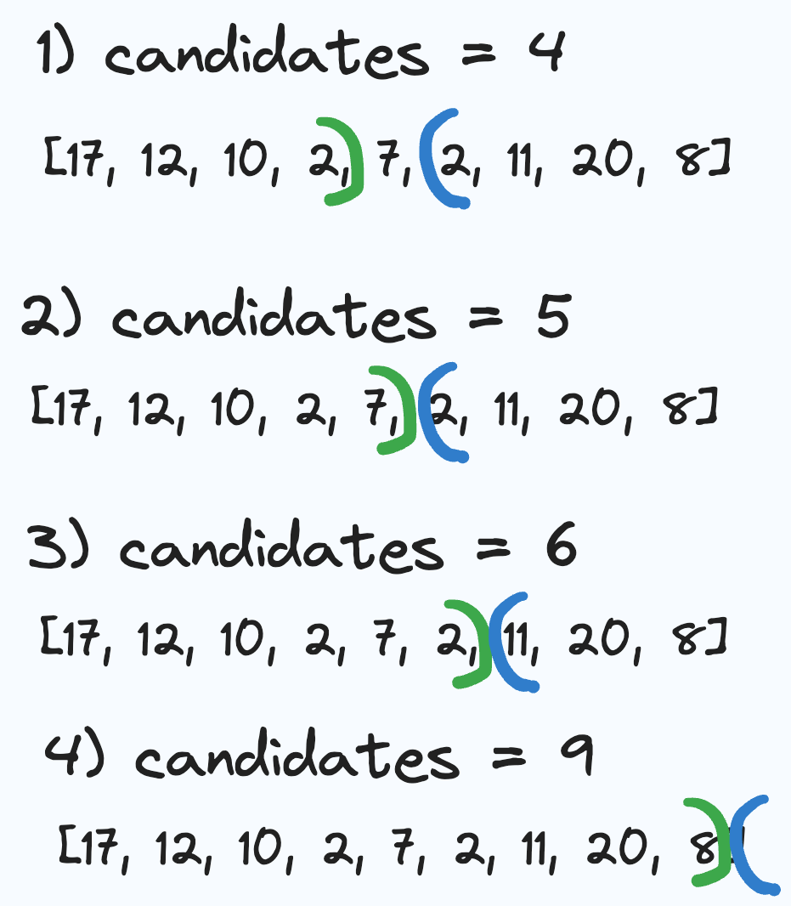

## 2462. Total Cost to Hire K Workers
You are given a 0-indexed integer array costs where costs[i] is the cost of hiring the ith worker.

You are also given two integers k and candidates. We want to hire exactly k workers according to the following rules:

You will run k sessions and hire exactly one worker in each session.
In each hiring session, choose the worker with the lowest cost from either the first candidates workers or the last candidates workers. Break the tie by the smallest index.
For example, if costs = [3,2,7,7,1,2] and candidates = 2, then in the first hiring session, we will choose the 4th worker because they have the lowest cost [3,2,7,7,1,2].
In the second hiring session, we will choose 1st worker because they have the same lowest cost as 4th worker but they have the smallest index [3,2,7,7,2]. Please note that the indexing may be changed in the process.
If there are fewer than candidates workers remaining, choose the worker with the lowest cost among them. Break the tie by the smallest index.
A worker can only be chosen once.
Return the total cost to hire exactly k workers.

 
```
Example 1:

Input: costs = [17,12,10,2,7,2,11,20,8], k = 3, candidates = 4
Output: 11
Explanation: We hire 3 workers in total. The total cost is initially 0.
- In the first hiring round we choose the worker from [17,12,10,2,7,2,11,20,8]. The lowest cost is 2, and we break the tie by the smallest index, which is 3. The total cost = 0 + 2 = 2.
- In the second hiring round we choose the worker from [17,12,10,7,2,11,20,8]. The lowest cost is 2 (index 4). The total cost = 2 + 2 = 4.
- In the third hiring round we choose the worker from [17,12,10,7,11,20,8]. The lowest cost is 7 (index 3). The total cost = 4 + 7 = 11. Notice that the worker with index 3 was common in the first and last four workers.
The total hiring cost is 11.


Example 2:

Input: costs = [1,2,4,1], k = 3, candidates = 3
Output: 4
Explanation: We hire 3 workers in total. The total cost is initially 0.
- In the first hiring round we choose the worker from [1,2,4,1]. The lowest cost is 1, and we break the tie by the smallest index, which is 0. The total cost = 0 + 1 = 1. Notice that workers with index 1 and 2 are common in the first and last 3 workers.
- In the second hiring round we choose the worker from [2,4,1]. The lowest cost is 1 (index 2). The total cost = 1 + 1 = 2.
- In the third hiring round there are less than three candidates. We choose the worker from the remaining workers [2,4]. The lowest cost is 2 (index 0). The total cost = 2 + 2 = 4.
The total hiring cost is 4.
 

Constraints:

1 <= costs.length <= 10e5 
1 <= costs[i] <= 10e5
1 <= k, candidates <= costs.length
```

## Cases with different number of candidates

