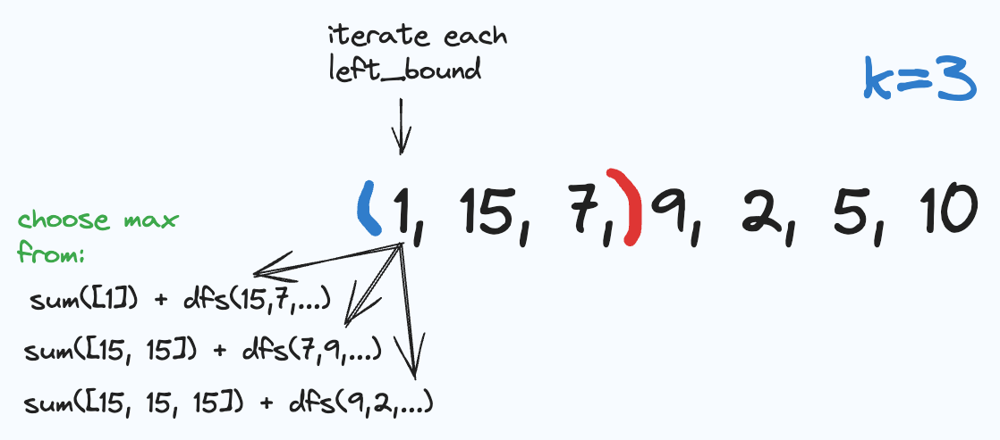

## 1043. Partition Array for Maximum Sum
```
Given an integer array arr, partition the array into (contiguous) subarrays of length at most k. After partitioning, each subarray has their values changed to become the maximum value of that subarray.

Return the largest sum of the given array after partitioning. Test cases are generated so that the answer fits in a 32-bit integer.

 

Example 1:

Input: arr = [1,15,7,9,2,5,10], k = 3
Output: 84
Explanation: arr becomes [15,15,15,9,10,10,10]


Example 2:

Input: arr = [1,4,1,5,7,3,6,1,9,9,3], k = 4
Output: 83


Example 3:

Input: arr = [1], k = 1
Output: 1
 

Constraints:

1 <= arr.length <= 500
0 <= arr[i] <= 10e9
1 <= k <= arr.length
```

## Memoization approach
