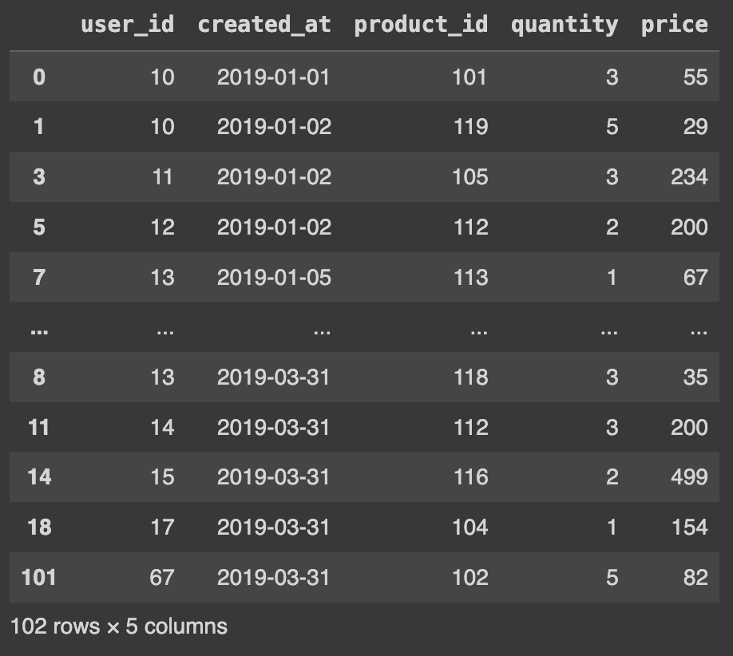
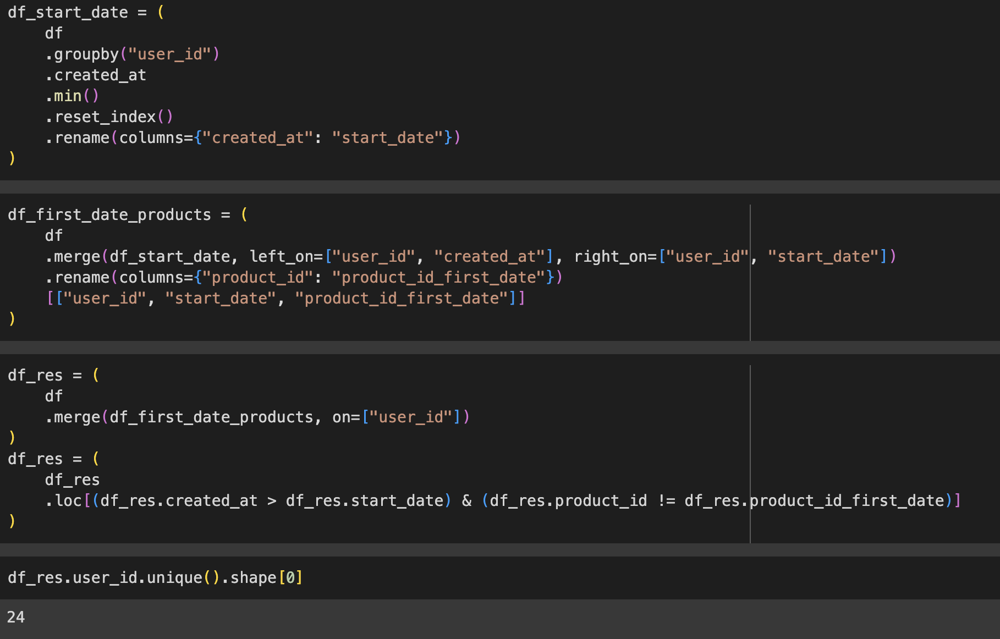
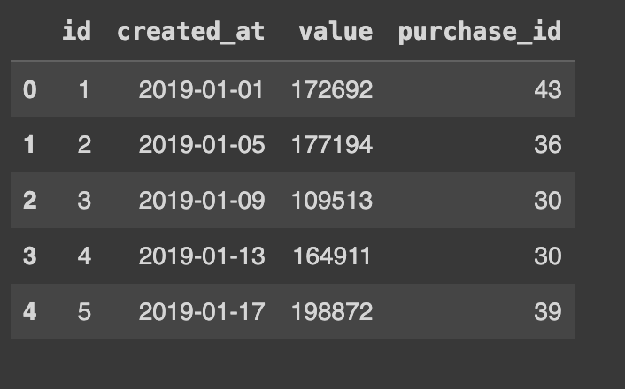

```
Задача 1.

У вас есть таблица покупок в приложении по пользователям. 
Пользователи, совершившие первую покупку в приложении, попадают в маркетинговую кампанию, 
где они видят призывы к совершению дополнительных покупок в приложении. 
Найдите количество пользователей, которые совершили дополнительные покупки в приложении благодаря успеху маркетинговой кампании.

Маркетинговая кампания начинается только через день после первой покупки в приложении, поэтому пользователи,
 совершившие одну или несколько покупок ТОЛЬКО в первый день, не учитываются, как и пользователи, которые со временем 
 приобретают только те продукты, которые они купили в первый день.
 
```


## Solution



```
Задача 2.

Учитывая таблицу покупок по датам, рассчитайте процентное изменение выручки за месяц. 
Вывод должен включать дату год-месяц (YYYY-MM) и процентное изменение, округленное до второго знака после запятой, 
и отсортированное от начала года до конца года. Колонка процентного изменения будет заполнена со 2-го месяца вперед 
и может быть рассчитана как ((выручка этого месяца - выручка прошлого месяца) / выручка прошлого месяца)*100

```


```
Задача 3.

В чем отличие запроса: 

select * 
from A inner join B
on 1 == 1 


От запроса:
select * 
from A cross join B

Ответ: одно и то же, с нюансом, когда одна таблица пустая
```