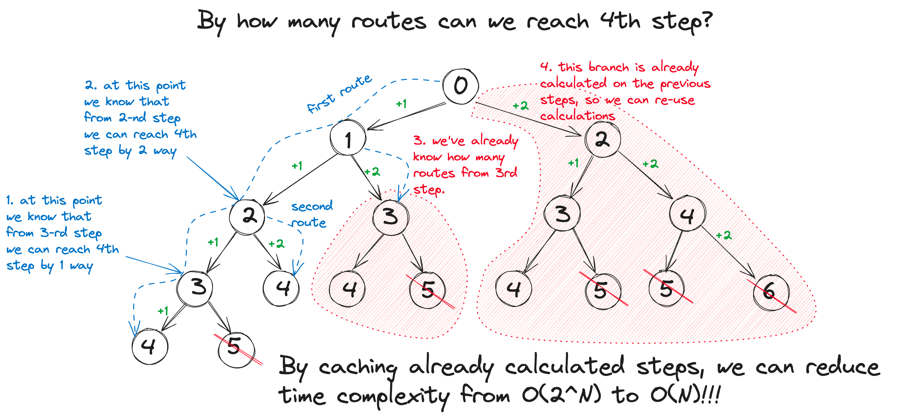
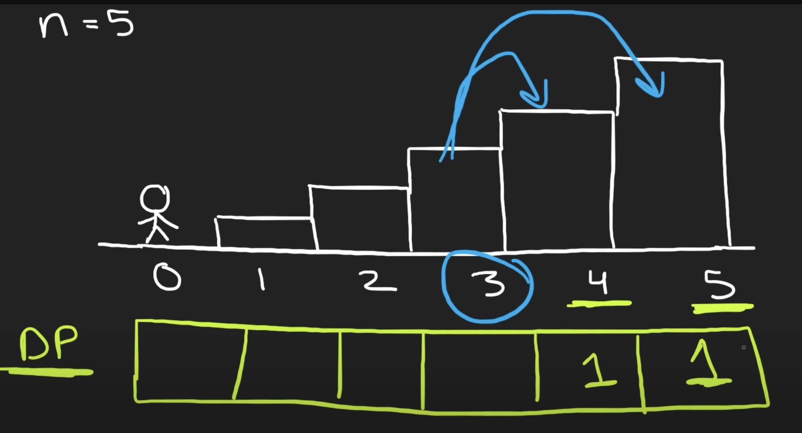

## 70. Climbing Stairs
You are climbing a staircase. It takes n steps to reach the top.

Each time you can either climb 1 or 2 steps. In how many distinct ways can you climb to the top?

 
```
Example 1:

Input: n = 2
Output: 2
Explanation: There are two ways to climb to the top.
1. 1 step + 1 step
2. 2 steps

Example 2:

Input: n = 3
Output: 3
Explanation: There are three ways to climb to the top.
1. 1 step + 1 step + 1 step
2. 1 step + 2 steps
3. 2 steps + 1 step
 

Constraints:

1 <= n <= 45
```
## Memoization approach



## Dynamic Programming approach



We start from the base case.
1. How many ways to reach 5th step from 4th and 5th steps? Answer: 1
2. How many ways to reach 5th step from 3rd? It depends on previous steps:
DP[3] = DP[4] + DP[5]
3. And so on. Basically we have a Fibonacci sequence. And we don't have to store whole array. We need just two
variables.
