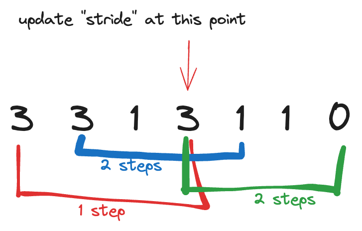

## 45. Jump Game II.

You are given a 0-indexed array of integers nums of length n. You are initially positioned at nums[0].

Each element nums[i] represents the maximum length of a forward jump from index i. In other words, 
if you are at nums[i], you can jump to any nums[i + j] where:

0 <= j <= nums[i] and
i + j < n


Return the minimum number of jumps to reach nums[n - 1]. The test cases are generated such that you can reach nums[n - 1].

 
```
Example 1:

Input: nums = [2,3,1,1,4]
Output: 2
Explanation: The minimum number of jumps to reach the last index is 2. Jump 1 step from index 0 to 1, then 3 steps to the last index.


Example 2:

Input: nums = [2,3,0,1,4]
Output: 2
 

Constraints:

1 <= nums.length <= 10e4
0 <= nums[i] <= 1000
It's guaranteed that you can reach nums[n - 1].

```

## Solution

    Keeps track of the farthest reachable position ("horizon") at each step and updates the number of jumps needed to
    reach that farthest position.
    Increase number of steps by 1, when reach end of current stride, and update stride variable.

