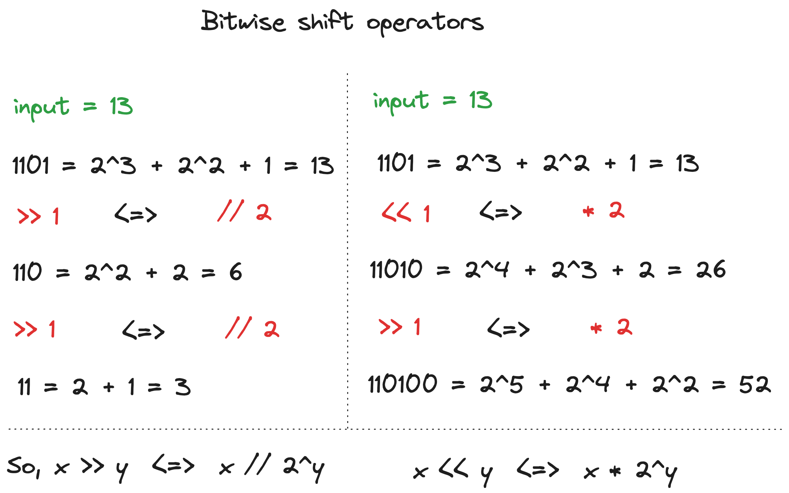

## 190. Reverse Bits
Reverse bits of a given 32 bits unsigned integer.
```
Example 1:

Input: n = 00000010100101000001111010011100 <br>
Output:    964176192 (00111001011110000010100101000000) <br>
Explanation: The input binary string 00000010100101000001111010011100 represents the unsigned integer 43261596, 
so return 964176192 which its binary representation is 00111001011110000010100101000000.


Example 2:

Input: n = 11111111111111111111111111111101 <br>
Output:   3221225471 (10111111111111111111111111111111) <br>
Explanation: The input binary string 11111111111111111111111111111101 represents the unsigned integer 4294967293, 
so return 3221225471 which its binary representation is 10111111111111111111111111111111.
 

Constraints:

The input must be a binary string of length 32
 

Follow up: If this function is called many times, how would you optimize it?

```


