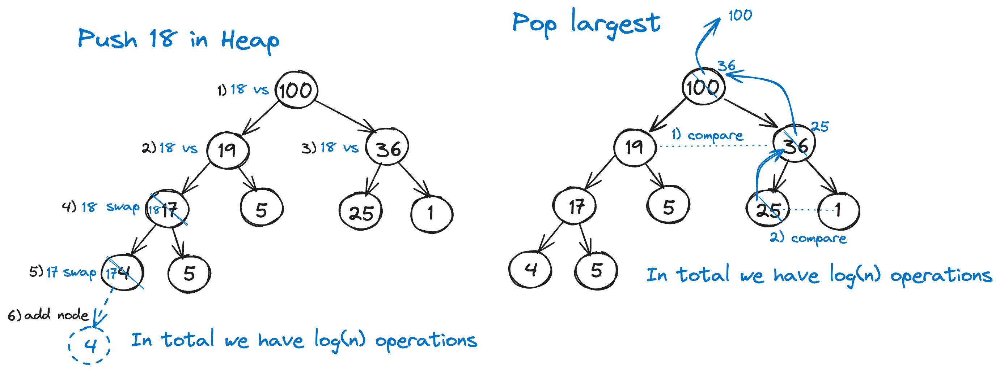

## Heap 



```
import heapq
from typing import List


def heap_sort(nums: List[int]) -> List[int]:
    """
    Convert list to heap. Then pop all elements one by one from heap.

    Time complexity: O(n*log(n))
    """
    heapq.heapify(nums)
    res = []
    while nums:  # O(n)
        min_el = heapq.heappop(nums)  # O(log(n))
        res.append(min_el)
    return res


if __name__ == '__main__':
    nums = [3, 2, 3, 1, 2, 10, 4, 5, 5, 6]

    heapq.heapify(nums)  # O(n)
    print(nums)  # [1, 2, 3, 2, 3, 10, 4, 5, 5, 6]

    heapq.heappush(nums, 7)  # O(log(n))
    print(nums)  # [1, 2, 3, 2, 3, 10, 4, 5, 5, 6, 7]

    min_el = heapq.heappop(nums)  # O(log(n))
    print(min_el)  # 1
    print(nums)  # [2, 2, 3, 5, 3, 10, 4, 5, 7, 6]

    top_least = heapq.nsmallest(3, nums)  # O(k*log(n))
    print(top_least)  # [2, 2, 3]
    print(nums)  # [2, 2, 3, 5, 3, 10, 4, 5, 7, 6]

    nums = [3, 2, 3, 1, 2, 10, 4, 5, 5, 6]
    nums = heap_sort(nums)  # O(nlog(n))
    print(nums)  # [1, 2, 2, 3, 3, 4, 5, 5, 6, 10]

    a = [1, 3, 5, 7, 9, 11]  # should be sorted
    b = [0, 2, 4, 6, 8, 10]  # should be sorted
    generator_ = heapq.merge(a, b)  # returns generator
    print(list(generator_))  # [0, 1, 2, 3, 4, 5, 6, 7, 8, 9, 10, 11]

```

## Merge operation.
If you are merging k sorted arrays and each array has N elements then heapq.merge will perform the operation in time 
complexity of k * N * log(k). 

Because k * N is the total number of elements across all the k arrays and each element has to be 
compared. 

While log(k) is the time complexity of the bubble down operations from the top of the heap 
(that is the height of the heap).


## How to find k largest elements?
One approach with time complexity is O(N * log(k)).

Algorithm: 

1) Heapify is called only on the first k elements of the iterable. 
That's O(k), but is insignificant if k is much smaller than N. 
2) Then all the remaining elements are added to this "little heap" via heappushpop, one at a time. 
That takes O(log(k)) time per invocation of heappushpop, O(N*log(k)) in total. 
The length of the heap remains k throughout. 
3) At the very end, the heap is sorted which costs O(k * log(k)) (e.g. by heap popping k times with log(k) at each run).
but that's also insignificant if k is much smaller than N.

