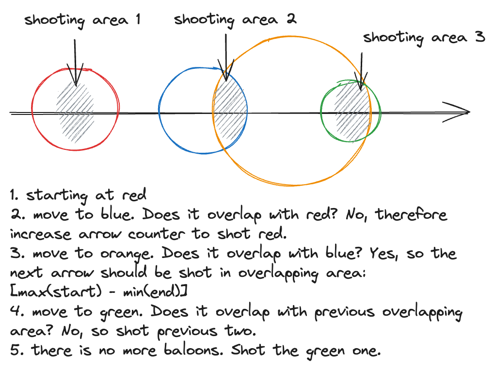

## 452. Minimum Number of Arrows to Burst Balloons
There are some spherical balloons taped onto a flat wall that represents the XY-plane. The balloons are represented as a
2D integer array points where points[i] = [xstart, xend] denotes a balloon whose horizontal diameter stretches between 
xstart and xend. You do not know the exact y-coordinates of the balloons.

Arrows can be shot up directly vertically (in the positive y-direction) from different points along the x-axis. 
A balloon with xstart and xend is burst by an arrow shot at x if xstart <= x <= xend. There is no limit to the number 
of arrows that can be shot. A shot arrow keeps traveling up infinitely, bursting any balloons in its path.

Given the array points, return the minimum number of arrows that must be shot to burst all balloons.

```
Example 1:

Input: points = [[10,16],[2,8],[1,6],[7,12]]
Output: 2
Explanation: The balloons can be burst by 2 arrows:
- Shoot an arrow at x = 6, bursting the balloons [2,8] and [1,6].
- Shoot an arrow at x = 11, bursting the balloons [10,16] and [7,12].


Example 2:

Input: points = [[1,2],[3,4],[5,6],[7,8]]
Output: 4
Explanation: One arrow needs to be shot for each balloon for a total of 4 arrows.


Example 3:

Input: points = [[1,2],[2,3],[3,4],[4,5]]
Output: 2
Explanation: The balloons can be burst by 2 arrows:
- Shoot an arrow at x = 2, bursting the balloons [1,2] and [2,3].
- Shoot an arrow at x = 4, bursting the balloons [3,4] and [4,5].
 

Constraints:

1 <= points.length <= 10e5
points[i].length == 2
-2e31 <= xstart < xend <= 2e31 - 1

```

## Solution.

