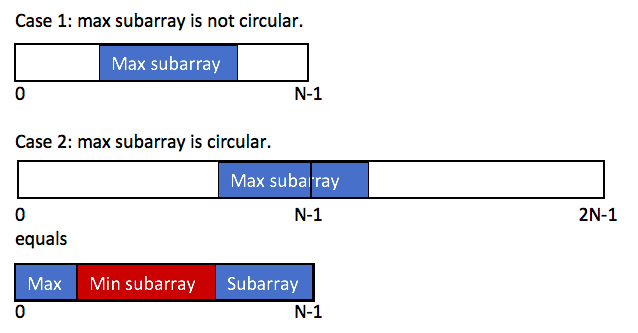

## 53. Maximum Subarray

Given an integer array nums, find the subarray with the largest sum, and return its sum.

 
```
Example 1:

Input: nums = [-2,1,-3,4,-1,2,1,-5,4]
Output: 6
Explanation: The subarray [4,-1,2,1] has the largest sum 6.


Example 2:

Input: nums = [1]
Output: 1
Explanation: The subarray [1] has the largest sum 1.


Example 3:

Input: nums = [5,4,-1,7,8]
Output: 23
Explanation: The subarray [5,4,-1,7,8] has the largest sum 23.
 

Constraints:

1 <= nums.length <= 10e5
-10e4 <= nums[i] <= 10e4
 

Follow up: If you have figured out the O(n) solution, try coding another solution using the divide and conquer approach,
 which is more subtle.
```

## Solution 

There are two possible cases:
- Case 1. The first is that the subarray take only a middle part, and we know how to find the max subarray sum.
- Case2. The second is that the subarray take a part of head array and a part of tail array.
We can transfer this case to the first one.



The maximum result equals to the total sum minus the minimum subarray sum.

#### Prove of the second case
```
max(prefix+suffix)
= max(total sum - subarray)
= total sum + max(-subarray)
= total sum - min(subarray)
```

#### Corner case
```
Just one to pay attention:
If all numbers are negative, maxSum = max(A) and minSum = sum(A).
In this case, max(maxSum, total - minSum) = 0, which means the sum of an empty subarray.
According to the deacription, We need to return the max(A), instead of sum of am empty subarray.
So we return the maxSum to handle this corner case.
```