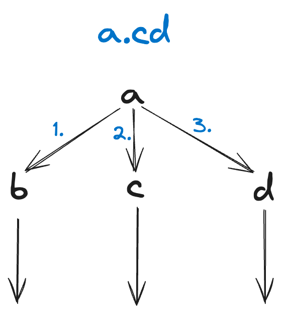

## 211. Design Add and Search Words Data Structure
```
Design a data structure that supports adding new words and finding if a string matches any previously added string.

Implement the WordDictionary class:

WordDictionary() Initializes the object.
void addWord(word) Adds word to the data structure, it can be matched later.
bool search(word) Returns true if there is any string in the data structure that matches word or false otherwise. word may contain dots '.' where dots can be matched with any letter.
 

Example:

Input
["WordDictionary","addWord","addWord","addWord","search","search","search","search"]
[[],["bad"],["dad"],["mad"],["pad"],["bad"],[".ad"],["b.."]]
Output
[null,null,null,null,false,true,true,true]

Explanation
WordDictionary wordDictionary = new WordDictionary();
wordDictionary.addWord("bad");
wordDictionary.addWord("dad");
wordDictionary.addWord("mad");
wordDictionary.search("pad"); // return False
wordDictionary.search("bad"); // return True
wordDictionary.search(".ad"); // return True
wordDictionary.search("b.."); // return True
 

Constraints:

1 <= word.length <= 25
word in addWord consists of lowercase English letters.
word in search consist of '.' or lowercase English letters.
There will be at most 2 dots in word for search queries.
At most 10e4 calls will be made to addWord and search.
```

## Trie Approach
